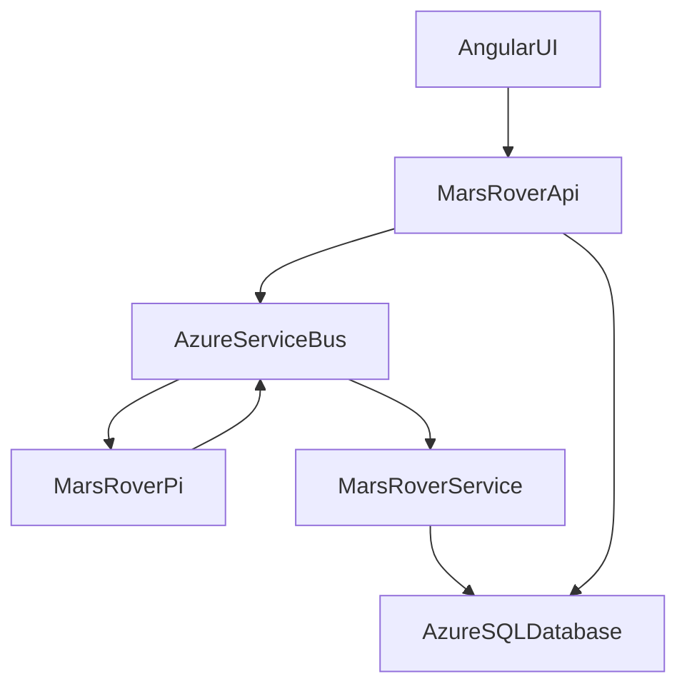

# MarsRover

*Work in progress

The MarsRover project will mimic the Mars Rover on a smaller scale.  

Phase 1 - Angular UI/C# API/C# Service/Azure SQL Database/Raspberry Pi
(No fancy web ui or authentication for now, the goal is to get it roughly working)

1. Angular UI to send instructions and receive telemetry data via C# API.
2. C# API will create and send Azure NService Bus Command Messages (or RabbitMq).  
3. Raspberry Pi Rover will get the Service Bus message, execute the directions, then send a response Message after executing the instructions.
4. A C# service will listen for the response Service Bus message and populate a row in a Azure SQL Database.
5. Angular UI will check periodically for new information by calling the C# API to query data from the Azue SQL Database.

Phase 2

1. Add authentication to C# API
2. Add authentication to Angular UI
3. Add CI/CD
4. Make UI nicer looking
